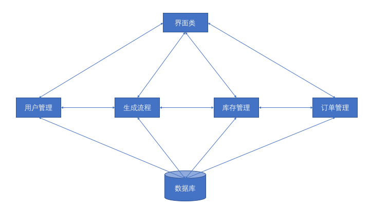

# mitcpro
## 整体设计
整个系统分为如下三个部分：第一行为用户界面，第二行为后台处理逻辑，第三行为数据库。

其中第一和第二部分全部使用 C# 编写，体现为一个个类，第三部分是SQLServer 数据库。

界面是一个类，负责界面的绘制，以及根据用户的操作调用第二行中对应模块的对应方法，获取返回数据并展示。

后台逻辑根据功能分为多个类，每一个类负责向界面提供接口，响应用户操作；还负责和数据库交互，存取数据。其中生产流程涉及多个流程，前期先做一个流程。该流程完成之后，再补充其他流程。

